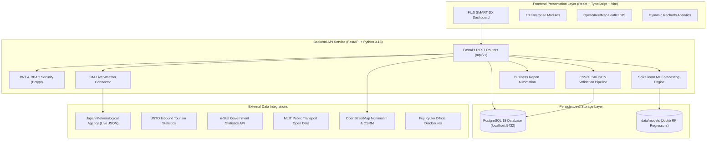

# FUJI SMART DX – System Architecture

```mermaid
graph TD
    subgraph ClientLayer["Frontend Presentation Layer (React + TypeScript + Vite)"]
        UI["FUJI SMART DX Dashboard"]
        Sidebar["13 Enterprise Modules"]
        Leaflet["OpenStreetMap Leaflet GIS"]
        Recharts["Dynamic Recharts Analytics"]
    end

    subgraph APILayer["Backend API Service (FastAPI + Python 3.13)"]
        Router["FastAPI REST Routers (/api/v1)"]
        AuthService["JWT & RBAC Security (Bcrypt)"]
        JMAConnector["JMA Live Weather Connector"]
        UploadPipeline["CSV/XLSX/JSON Validation Pipeline"]
        MLPipeline["Scikit-learn ML Forecasting Engine"]
        ReportsService["Business Report Automation"]
    end

    subgraph DataLayer["Persistence & Storage Layer"]
        PG[("PostgreSQL 18 Database (localhost:5432)")]
        ModelsDir[("data/models (Joblib RF Regressors)")]
    end

    subgraph ExternalSources["External Data Integrations"]
        JMA["Japan Meteorological Agency (Live JSON)"]
        JNTO["JNTO Inbound Tourism Statistics"]
        EStat["e-Stat Government Statistics API"]
        MLIT["MLIT Public Transport Open Data"]
        OSM["OpenStreetMap Nominatim & OSRM"]
        FujiCorporate["Fuji Kyuko Official Disclosures"]
    end

    UI --> Router
    Router --> AuthService
    Router --> JMAConnector
    Router --> UploadPipeline
    Router --> MLPipeline
    Router --> ReportsService

    JMAConnector --> JMA
    Router --> OSM
    Router --> PG
    MLPipeline --> ModelsDir
    UploadPipeline --> PG
```
