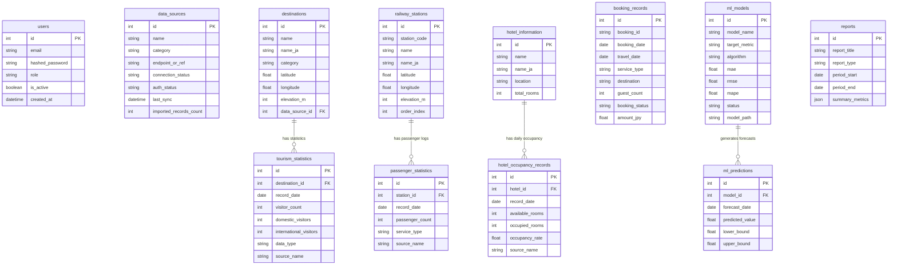

# FUJI SMART DX – Database ER Schema

```mermaid
erDiagram
    users {
        int id PK
        string email
        string hashed_password
        string role
        boolean is_active
        datetime created_at
    }

    data_sources {
        int id PK
        string name
        string category
        string endpoint_or_ref
        string connection_status
        string auth_status
        datetime last_sync
        int imported_records_count
    }

    destinations {
        int id PK
        string name
        string name_ja
        string category
        float latitude
        float longitude
        int elevation_m
        int data_source_id FK
    }

    railway_stations {
        int id PK
        string station_code
        string name
        string name_ja
        float latitude
        float longitude
        int elevation_m
        int order_index
    }

    tourism_statistics {
        int id PK
        int destination_id FK
        date record_date
        int visitor_count
        int domestic_visitors
        int international_visitors
        string data_type
        string source_name
    }

    passenger_statistics {
        int id PK
        int station_id FK
        date record_date
        int passenger_count
        string service_type
        string source_name
    }

    hotel_information {
        int id PK
        string name
        string name_ja
        string location
        int total_rooms
    }

    hotel_occupancy_records {
        int id PK
        int hotel_id FK
        date record_date
        int available_rooms
        int occupied_rooms
        float occupancy_rate
        string source_name
    }

    booking_records {
        int id PK
        string booking_id
        date booking_date
        date travel_date
        string service_type
        string destination
        int guest_count
        string booking_status
        float amount_jpy
    }

    ml_models {
        int id PK
        string model_name
        string target_metric
        string algorithm
        float mae
        float rmse
        float mape
        string status
        string model_path
    }

    ml_predictions {
        int id PK
        int model_id FK
        date forecast_date
        float predicted_value
        float lower_bound
        float upper_bound
    }

    reports {
        int id PK
        string report_title
        string report_type
        date period_start
        date period_end
        json summary_metrics
    }

    destinations ||--o{ tourism_statistics : "has statistics"
    railway_stations ||--o{ passenger_statistics : "has passenger logs"
    hotel_information ||--o{ hotel_occupancy_records : "has daily occupancy"
    ml_models ||--o{ ml_predictions : "generates forecasts"
```
